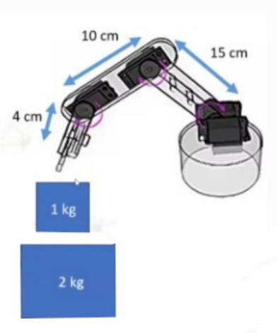

# 🤖 Robotic Arm Torque Calculation & Servo Selection - حساب عزم دوران ذراع الروبوت واختيار محركات السيرفو

## 📐 المعطيات الأساسية





**أبعاد الذراع:**
- الوصلة الأولى (L1): 15 سم
- الوصلة الثانية (L2): 10 سم
- الماسك/القابض (L3): 4 سم

**الحمولات:**
- المهمة الأولى: 1 كجم
- المهمة الثانية: 2 كجم

**الافتراضات:**
- وزن المحرك 3 + القابض: 0.2 كجم
- وزن المحرك 2 + الوصلة 2: 0.3 كجم
- وزن الوصلة 1: 0.25 كجم
- تسارع الجاذبية: 9.8 م/ث²
- معامل الأمان: 1.5×

---

## 1️⃣ السؤال الأول: حساب عزم الدوران لحمل 1 كجم

### طريقة الحساب
```
العزم (kg·cm) = الكتلة (kg) × المسافة (cm)
العزم المطلوب = العزم الأساسي × معامل الأمان (1.5)
```

**السيناريو:** الذراع ممتدة أفقياً بالكامل (أسوأ حالة)

---

### أ) المحرك M3 (المعصم/Wrist)

**يحمل:** القابض + الحمل (1 كجم)
```
العزم الأساسي = 1.0 كجم × 4 سم = 4.0 kg·cm
العزم المطلوب = 4.0 × 1.5 = 6.0 kg·cm
```

**✅ العزم المطلوب: 6.0 kg·cm**

---

### ب) المحرك M2 (الكوع/Elbow)

**يحمل:** الحمل + M3 والقابض + الوصلة 2
```
عزم الحمل وM3 = (1.0 + 0.2) كجم × 10 سم = 12.0 kg·cm
عزم الوصلة 2 (من مركزها) = 0.3 كجم × 5 سم = 1.5 kg·cm
العزم الأساسي = 12.0 + 1.5 = 13.5 kg·cm
العزم المطلوب = 13.5 × 1.5 = 20.25 kg·cm
```

**✅ العزم المطلوب: 20.25 kg·cm**

---

### ج) المحرك M1 (القاعدة/Base)

**يحمل:** كل المكونات السابقة + الوصلة 1
```
عزم المكونات = (1.0 + 0.2 + 0.3) كجم × 15 سم = 22.5 kg·cm
عزم الوصلة 1 (من مركزها) = 0.25 كجم × 7.5 سم = 1.875 kg·cm
العزم الأساسي = 22.5 + 1.875 = 24.375 kg·cm
العزم المطلوب = 24.375 × 1.5 = 36.56 kg·cm
```

**✅ العزم المطلوب: 36.56 kg·cm**

---

### د) اختيار المحركات المناسبة

| المفصل | العزم المطلوب | المحرك المختار | عزم المحرك | رابط الشراء |
|--------|---------------|----------------|-----------|-------------|
| **M3** (المعصم) | 6.0 kg·cm | **MG996R** | ~11 kg·cm @ 6V | [Amazon - MG996R](https://www.amazon.com/Smraza-MG996R-Torque-Digital-Arduino/dp/B07MFK266B/) |
| **M2** (الكوع) | 20.25 kg·cm | **DS3218MG** | ~23 kg·cm @ 7.4V | [Amazon - DS3218MG](https://www.amazon.com/DS3218-Update-Waterproof-Baja-Robot/dp/B076CNKQX4/) |
| **M1** (القاعدة) | 36.56 kg·cm | **DS3235SG** | ~41 kg·cm @ 7.4V | [Amazon - DS3235SG](https://www.amazon.com/Quimat-DS3235-Digital-Waterproof-Control/dp/B07TY2YRS1/) |

---

## 2️⃣ السؤال الثاني: تحليل حمل 2 كجم

### أ) هل المحركات المختارة قادرة على رفع 2 كجم؟

#### إعادة الحسابات مع حمل 2 كجم:

**المحرك M3:**
```
العزم الأساسي = 2.0 كجم × 4 سم = 8.0 kg·cm
العزم المطلوب = 8.0 × 1.5 = 12.0 kg·cm
```
- المحرك المتاح: MG996R (11 kg·cm)
- النتيجة: ❌ **غير كافٍ** (نقص 1 kg·cm)

**المحرك M2:**
```
العزم الأساسي = ((2.0 + 0.2) × 10) + (0.3 × 5) = 22.0 + 1.5 = 23.5 kg·cm
العزم المطلوب = 23.5 × 1.5 = 35.25 kg·cm
```
- المحرك المتاح: DS3218MG (23 kg·cm)
- النتيجة: ❌ **غير كافٍ** (نقص 12.25 kg·cm)

**المحرك M1:**
```
العزم الأساسي = ((2.0 + 0.2 + 0.3) × 15) + (0.25 × 7.5) = 37.5 + 1.875 = 39.375 kg·cm
العزم المطلوب = 39.375 × 1.5 = 59.06 kg·cm
```
- المحرك المتاح: DS3235SG (41 kg·cm)
- النتيجة: ❌ **غير كافٍ** (نقص 18.06 kg·cm)

#### 📊 جدول المقارنة:

| المحرك | العزم المتاح | العزم المطلوب (2 كجم) | الحالة |
|--------|--------------|----------------------|--------|
| M3 | 11 kg·cm | 12.0 kg·cm | ❌ نقص 9% |
| M2 | 23 kg·cm | 35.25 kg·cm | ❌ نقص 53% |
| M1 | 41 kg·cm | 59.06 kg·cm | ❌ نقص 44% |

**✅ الإجابة النهائية: لا، المحركات المختارة لا يمكنها رفع 2 كجم بأمان**

---

### ب) هل إضافة التروس تحل المشكلة؟

#### ⚙️ كيف تعمل التروس؟
```
نسبة التروس 2:1 تعني:
✅ العزم = العزم الأصلي × 2
❌ السرعة = السرعة الأصلية ÷ 2
```

#### مثال عملي:
```
M1 مع تروس 2:1:
- العزم الجديد = 41 × 2 = 82 kg·cm ✅ (يغطي المطلوب 59 kg·cm)

M2 مع تروس 2:1:
- العزم الجديد = 23 × 2 = 46 kg·cm ✅ (يغطي المطلوب 35.25 kg·cm)

M3 مع تروس 2:1:
- العزم الجديد = 11 × 2 = 22 kg·cm ✅ (يغطي المطلوب 12 kg·cm)
```

**✅ نعم، التروس تحل مشكلة العزم نظرياً**

---

### ج) سلبيات استخدام التروس:

#### 1. 🐌 **بطء الحركة الشديد**
- نسبة 2:1 تعني أن الذراع ستتحرك بنصف السرعة الأصلية
- غير مناسب للتطبيقات التي تحتاج استجابة سريعة

#### 2. 🔄 **الارتداد الميكانيكي (Backlash)**
- فجوات صغيرة بين أسنان التروس تسبب عدم دقة في الموضع
- اهتزازات عند تغيير اتجاه الحركة
- تراكم الأخطاء في الحركات المتتالية

#### 3. ⚖️ **زيادة الوزن والتعقيد**
- إضافة صناديق تروس (100-300 جرام لكل محرك)
- الوزن الإضافي يزيد العزم المطلوب على المفاصل الأخرى
- تصميم ميكانيكي أكثر تعقيداً

#### 4. 📉 **فقدان الكفاءة**
- كل مرحلة تروس تفقد 5-10% من الطاقة
- زيادة الحرارة واستهلاك البطارية

#### 5. 🔧 **صعوبة الصيانة**
- تحتاج تشحيم دوري
- تآكل الأسنان مع الوقت
- ضوضاء أثناء التشغيل

---

### د) البدائل لحل مشكلة 2 كجم:

#### 🏆 **البديل 1: محركات أقوى** (الحل الأمثل)

**المحركات المقترحة:**

| المفصل | المحرك الجديد | العزم | السعر التقريبي | الرابط |
|--------|---------------|-------|----------------|--------|
| M3 | **MG996R** | 11 kg·cm ✅ | $8-12 | [Amazon](https://www.amazon.com/Smraza-MG996R-Torque-Digital-Arduino/dp/B07MFK266B/) |
| M2 | **DS3235SG** | 41 kg·cm ✅ | $18-25 | [Amazon](https://www.amazon.com/Quimat-DS3235-Digital-Waterproof-Control/dp/B07TY2YRS1/) |
| M1 | **RDS5160** أو **Dynamixel MX-64** | 60-74 kg·cm ✅ | $45-250 | [RobotShop](https://www.robotshop.com/products/dynamixel-mx-64t-r-ttl-servo) |

**المزايا:**
- ✅ حل نظيف ومباشر
- ✅ سرعة كاملة (100%)
- ✅ دقة عالية (لا backlash)
- ✅ موثوقية أفضل

**العيوب:**
- ❌ تكلفة أعلى ($70-300)

---

#### ⚖️ **البديل 2: أوزان موازنة (Counterweights)**

**المبدأ:**
```
إضافة أوزان على الجانب المقابل لتقليل العزم المطلوب

مثال:
وزن موازن 1 كجم على مسافة 15 سم من M1
= يقلل العزم المطلوب بنسبة ~50%
```

**المزايا:**
- ✅ تكلفة منخفضة جداً ($10-20)
- ✅ سرعة كاملة (100%)
- ✅ دقة عالية

**العيوب:**
- ❌ زيادة الوزن الإجمالي
- ❌ تقليل مساحة العمل

---

#### 🪶 **البديل 3: تقليل وزن الذراع**

**الطرق:**
- استخدام ألياف الكربون بدلاً من البلاستيك
- تصميم هيكل مجوف (Hollow Structure)
- استخدام محركات أخف

**المزايا:**
- ✅ تقليل مباشر للعزم المطلوب
- ✅ استجابة أسرع
- ✅ كفاءة طاقة أفضل

**العيوب:**
- ❌ تكلفة مواد أعلى
- ❌ تعقيد في التصنيع

---

#### 🌀 **البديل 4: نوابض مساعدة (Springs)**

**المبدأ:**
```
إضافة نوابض تساعد في رفع الذراع ضد الجاذبية
= تقليل الحمل الدائم على المحركات بنسبة 20-30%
```

**المزايا:**
- ✅ تكلفة منخفضة ($5-15)
- ✅ لا تؤثر على السرعة

**العيوب:**
- ❌ صعوبة ضبط القوة المناسبة
- ❌ قد تسبب اهتزازات

---

## 📊 مقارنة شاملة للحلول

| الحل | التكلفة | السرعة | الدقة | سهولة التنفيذ | التوصية |
|------|---------|--------|-------|---------------|---------|
| **تروس 2:1** | $40-60 | 🔴 50% | 🟡 متوسط | 🟡 متوسط | ⭐⭐⭐ |
| **محركات أقوى** | $70-300 | 🟢 100% | 🟢 ممتاز | 🟢 سهل | ⭐⭐⭐⭐⭐ |
| **أوزان موازنة** | $10-20 | 🟢 100% | 🟢 ممتاز | 🟡 متوسط | ⭐⭐⭐⭐ |
| **تقليل الوزن** | $30-100 | 🟢 100% | 🟢 ممتاز | 🔴 صعب | ⭐⭐⭐⭐ |
| **نوابض مساعدة** | $5-15 | 🟢 100% | 🟡 جيد | 🟡 متوسط | ⭐⭐⭐ |

---

## 🎯 التوصية النهائية

### للحمولة 1 كجم:
✅ **استخدم المحركات المختارة (MG996R, DS3218MG, DS3235SG)**

### للحمولة 2 كجم:
🏆 **الحل الموصى به: محركات أقوى + وزن موازن خفيف**
```
الخطة:
1. M3: الإبقاء على MG996R (كافٍ)
2. M2: ترقية إلى DS3235SG (41 kg·cm)
3. M1: ترقية إلى RDS5160 (60 kg·cm)
4. إضافة وزن موازن 500 جرام على M1

النتيجة:
✅ عزم كافٍ لرفع 2 كجم بأمان
✅ سرعة ممتازة (~90%)
✅ دقة عالية
💰 التكلفة الإجمالية: ~$80-100
```

---

## 📋 ملخص الإجابات

### السؤال 1: العزوم المطلوبة والمحركات

| المحرك | العزم المطلوب | المحرك المختار | الرابط |
|--------|---------------|----------------|--------|
| M3 | 6.0 kg·cm | MG996R (11 kg·cm) | [Amazon](https://www.amazon.com/Smraza-MG996R-Torque-Digital-Arduino/dp/B07MFK266B/) |
| M2 | 20.25 kg·cm | DS3218MG (23 kg·cm) | [Amazon](https://www.amazon.com/DS3218-Update-Waterproof-Baja-Robot/dp/B076CNKQX4/) |
| M1 | 36.56 kg·cm | DS3235SG (41 kg·cm) | [Amazon](https://www.amazon.com/Quimat-DS3235-Digital-Waterproof-Control/dp/B07TY2YRS1/) |

### السؤال 2: حمل 2 كجم

**أ) هل المحركات قادرة؟**
- ❌ **لا**، جميع المحركات تحتاج عزم أعلى

**ب) هل التروس تحل المشكلة؟**
- ✅ **نعم نظرياً**، تروس 2:1 تضاعف العزم

**ج) السلبيات:**
1. بطء الحركة (50% من السرعة الأصلية)
2. الارتداد الميكانيكي (Backlash)
3. زيادة الوزن والتعقيد
4. فقدان الكفاءة (5-10%)
5. صعوبة الصيانة والضوضاء

**د) البدائل:**
1. محركات أقوى (الأفضل)
2. أوزان موازنة
3. تقليل وزن الذراع
4. نوابض مساعدة

---
